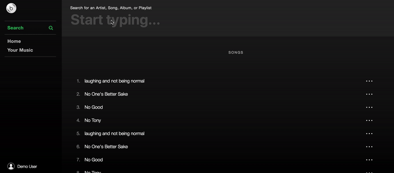

# **Bop**

[Live Version](https://bop-aa.herokuapp.com/)

## Table of Contents
- [Introduction](#introduction)
- [How It Works](#how-it-works)
- [Summary of Features](#features)
- [Project Design](#project-design)
- [Additional Features](#additional-features)

<a name="introduction"></a>

[Bop](https://bop-aa.herokuapp.com) is a simple single-page Spotify clone. It allows users to interact with playlists, stream music, explore new music, and follow other users and artists.

<a name="project-design"></a>
## Project Design̨
**Bop** was built over a 2-week period in April 2018 as a part of App Academy's Software Engineering Bootcamp.

<a name="how-it-works"></a>
## How It Works
**Bop** is built on a `Rails 5` backend, connected to `PostgresSQL` for database management. Communication between frontend and backend was made through Fetch AJAX requests. Responses are served up by `JBuilder` and operated upon and displayed by `React` and `Redux`. The `React Player` API was used to have greater control over music.

<a name="features"></a>
## Summary of Features
- RESTful
  - Data resources are generally accessed *via* standard `HTTP` requests to an API endpoints. The few nonRESTful routes were done for the sake of grouping certain actions (follows and playlist saves) with their respective controllers to better organize routes.
- Secure
  - User authentication is built from the ground up and maintained by in-app `BCrypt` password hashes as well as `SecureRandom` session key management.
- Dynamic
  - Single-page application han̨dles all UI actions without redirecting to new links or re-rendering material. State įs managed and dynamically updated using `Redux`.

## Specific Features

### `React Player`
The meat of my application is in the implementation of `React Player`. Using `refs` to store a reference to the DOM object `<ReactPlayer />` while managing local media state as well as global state (passing around variables such as `currentSong` and dispatchable actions such as `playSong()`), I was able to create a player that runs smoothly without pauses or unwanted behavior regardless of user interaction.


### `Followable`
- One feature I was excited about implementing was the many-to-many associations between `users` and other `users`, `playlists`, and `artists` through `follows`. I created model and controller `Concerns` that allowed me to apply the same code for all my `follows` features. `Followable` also allowed me to create powerful associations in my database:

```Ruby
module Followable
  extend ActiveSupport::Concern

  included do
    has_many :follows, as: :followable, dependent: :destroy
    has_many :followers, through: :follows, source: :user
  end

end

class Follow < ApplicationRecord

    belongs_to :followable, polymorphic: true 
    belongs_to :user

end

class User < ApplicationRecord
  include Followable
  
  has_many :followings, foreign_key: :user_id, class_name: 'Follow'
  has_many :followed_users, through: :followings, source: :followable, source_type: 'User'
  has_many :followed_playlists, through: :followings, source: :followable, source_type: 'Playlist'
  has_many :followed_artists, through: :followings, source: :followable, source_type: 'Artist'

end
```

I also add custom model-level validations to enhance user experience and prevent unwanted behavior:
```Ruby
class Follow < ApplicationRecord

    validate :user_cannot_follow_own_playlist
    validate :user_cannot_follow_self

    def user_cannot_follow_own_playlist
        if user_is_playlist_creator
            errors.add(:user, "cannot follow own playlist")
        end
    end

    def user_cannot_follow_self
        if user_is_self
            errors.add(:user, "can't follow themself")
        end
    end

    private

    def user_is_playlist_creator
        self.followable_type == 'Playlist' && Playlist.find(self.followable_id).creator_id == self.user_id
    end

    def user_is_self
        self.user_id == self.followable_id && self.followable_type == 'User'
    end
    
end
```

Doing so allowed me to create a multi-purpose set of front-end actions that handled type parsing for me:

```Javascript

// follow actions
export const follow = (type, id) => (dispatch) => (
    APIUtil.follow(type, id).then(response => dispatch(receiveFollow(response))
)

// session reducers on receive/removal of follow
case RECEIVE_FOLLOW:
  newState = merge({}, oldState);
  tableized = `${action.payload.followable_type.toLowerCase()}s`;
  newState.currentUser[`followed_${tableized}`].push(action.payload.followable_id);
  return newState;       
```

### `Search`
- Searches are fired automatically through a callback in a timeout function, waiting for users to finish typing to save on unnecessary queries the user doesn't want.



### `CSS Grid`
- Using `CSS Grid` granted me complete control over position and sizing of containers and made left-floating of music index items while center-justifying seamless.


<a name="additional-features"></a>
## Additional Features (to be implemented)
- Tracklists: Users will be able to skip through songs using media player buttons, shuffle tracks, and create lists.
- Dynamic Image Creation: playlist covers will be generated in the backend by making a collage of song's album cover photos.
- Dominant colors from album covers will be extracted to improve user experience.
- N + 1 Queries and unnecessary fetching will be eliminated.
- Settings page
  - Language support (French, Spanish, etc.)
  - Color schemes (Dark, Light, and Funky themes)
- Audio Visualization
  - Play button will optionally pulse to the beat of the song
  - Seek bar will have translucent music visualization pane
- See friends who are currently online
  - 'Currently listening to' pane
